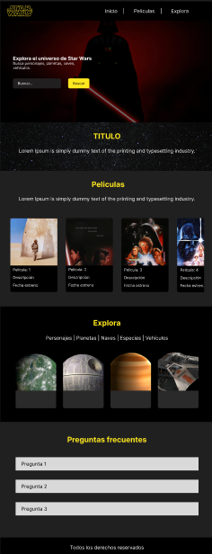

# Star Wars Finder

Una aplicación web interactiva que permite explorar el vasto universo de Star Wars utilizando la API oficial de SWAPI. Descubre personajes, planetas, especies, naves espaciales y vehículos de la saga más icónica del cine.

## Tabla de Contenidos

- [Características](#-características)
- [Tecnologías Utilizadas](#-tecnologías-utilizadas)
- [Instalación](#-instalación)
- [Uso](#-uso)
- [Estructura del Proyecto](#-estructura-del-proyecto)
- [API Utilizada](#-api-utilizada)
- [Capturas de Pantalla](#-capturas-de-pantalla)
- [Prototipo en Figma](#-prototipo-en-figma)
- [Autores](#autor)

## Características

### Funcionalidades Principal
- **Búsqueda Avanzada**: Busca por personajes, planetas, especies, naves espaciales y vehículos
- **Información Detallada**: Visualiza datos completos de cada elemento del universo Star Wars
- **Navegación por Categorías**: Explora contenido organizado en pestañas interactivas
- **Galería de Películas**: Visualiza todas las películas de la saga ordenadas por episodios
- **Interfaz Responsiva**: Diseño adaptable para dispositivos móviles y desktop

### Categorías Disponibles
- **Personajes**: Información sobre altura, peso, género, planeta de origen, especie
- **Planetas**: Datos sobre clima, terreno, población, período orbital
- **Especies**: Clasificación, lenguaje, planeta de origen, características físicas
- **Naves Espaciales**: Modelos, velocidad, capacidad de pasajeros, hyperdrive
- **Vehículos**: Especificaciones técnicas, velocidad, capacidad de carga

## Tecnologías Utilizadas

- **HTML5**: Estructura semántica de la aplicación
- **CSS3**: Estilos personalizados y animaciones
- **JavaScript (ES6+)**: Lógica de la aplicación y manejo de APIs
- **Bootstrap 5.3**: Framework CSS para diseño responsivo
- **SWAPI**: API pública de Star Wars para obtención de datos
- **Fetch API**: Para realizar peticiones HTTP asíncronas

## Instalación

1. **Clona el repositorio**
```bash
git clone https://github.com/tuusuario/star-wars-finder.git
cd star-wars-finder
```

2. **Estructura de archivos requerida**
```
star-wars-finder/
├── index.html
├── css/
│   └── estilos.css
├── js/
│   └── main.js
└── img/
    ├── icono-starwars.png
    ├── logo-starwars.png
    ├── imagen-fondo.jpg
    ├── estrellas.jpg
    ├── episodio1.png - episodio7.png
    ├── people1.png - people6.png
    ├── planet1.png - planet6.png
    ├── species1.png - species6.png
    ├── starship1.png - starship6.png
    └── vehicle1.png - vehicle6.png
```

3. **Ejecuta la aplicación**
   - Abre `index.html` en tu navegador web
   - O utiliza un servidor local como Live Server en VS Code

## Uso

### Búsqueda de Elementos
1. Selecciona la categoría deseada en el menú desplegable
2. Ingresa el nombre del elemento que deseas buscar
3. Haz clic en "Buscar" para obtener los resultados
4. Explora la información detallada que se muestra

### Navegación por Secciones
- **Inicio**: Búsqueda principal y hero section
- **Películas**: Galería de todas las películas de la saga
- **Explora**: Navegación por pestañas de diferentes categorías
- **FAQ**: Preguntas frecuentes sobre la aplicación

### Características Interactivas
- Navbar con efecto de scroll
- Hover effects en tarjetas y botones
- Acordeón para preguntas frecuentes
- Sistema de pestañas para categorías
- Diseño responsivo para todos los dispositivos

## Estructura del Proyecto

```
├── index.html              # Página principal
├── css/
│   └── estilos.css         # Estilos personalizados
├── js/
│   └── main.js             # Lógica de la aplicación
└── img/                    # Recursos visuales
    ├── logos/              # Logos y iconos
    ├── backgrounds/        # Imágenes de fondo
    ├── episodes/           # Portadas de películas
    └── categories/         # Imágenes por categorías
```

## API Utilizada

La aplicación utiliza **SWAPI (Star Wars API)** - una API REST gratuita que proporciona datos sobre el universo de Star Wars.

- **Base URL**: `https://swapi.py4e.com/api/`
- **Endpoints utilizados**:
  - `/people/` - Personajes
  - `/planets/` - Planetas
  - `/species/` - Especies
  - `/starships/` - Naves espaciales
  - `/vehicles/` - Vehículos
  - `/films/` - Películas

### Funciones Principales de la API

```javascript
// Búsqueda con filtros
fetch(`https://swapi.py4e.com/api/${category}/?search=${query}`)

// Obtención de datos relacionados
async function getNameFromUrl(url) {
  const res = await fetch(url);
  const data = await res.json();
  return data.name || data.title || 'Desconocido';
}
```

## Capturas de Pantalla

### Diseño en Figma


**🔗 Link de Figma**: [Ver diseño completo en Figma](https://www.figma.com/proto/0MxSGhg3AAXQq9X36r6SuX/maquetacion-star-wars?node-id=0-1&t=idciZ2pL8gxZgEri-1)

---

## Características Técnicas Adicionales

### Optimizaciones Implementadas
- **Lazy Loading**: Carga diferida de imágenes para mejor rendimiento
- **Error Handling**: Manejo robusto de errores de la API
- **Responsive Design**: Adaptación perfecta a diferentes tamaños de pantalla
- **Progressive Enhancement**: Funcionalidad básica sin JavaScript

### Próximas Mejoras
- [ ] Implementar sistema de favoritos
- [ ] Añadir modo oscuro/claro
- [ ] Integrar más endpoints de la API
- [ ] Añadir sistema de paginación
- [ ] Implementar PWA (Progressive Web App)

---

## Autor

Este proyecto fue desarrollado como parte de un proyecto académico por:

- **Bryan Villabona** - *Desarrollador Frontend*
- **Juan Pablo Cifuentes** - *Desarrollador Frontend*